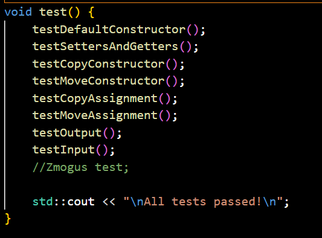
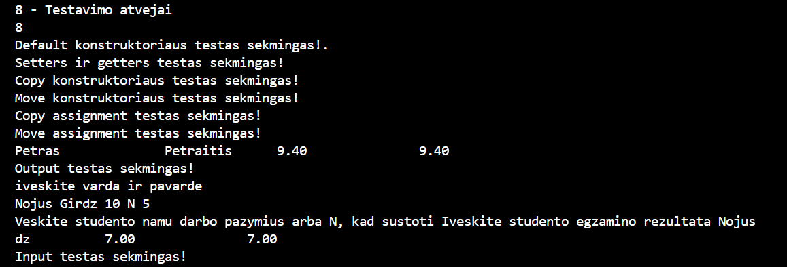
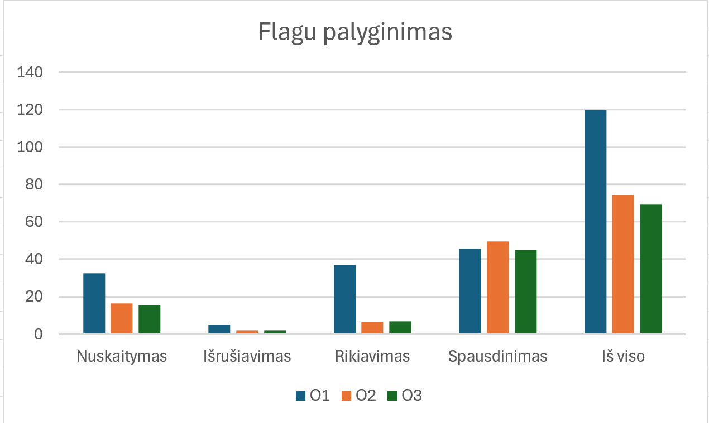

# Objektinio-programavimo-uzd

Ši programa del skirtingu konteineriu laikų testavimų naudojant struktūras
Kad paleist programa reikia tik paleisti run.bat faila

CPU: AMD Ryzen 7 8845, 8 Cores, 3,8 GHZ 
RAM: 16 GB, 5600 MT/s 
SSD NVMe  

 

 

 

 
